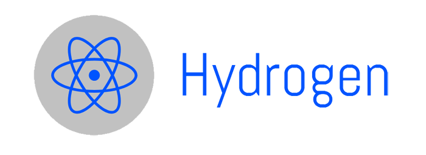

  

-----------------

**Hydrogen** is a home automation app that will control your ecobee thermostats to get around the CobbEMC peak hours. Thus saving you money!
  
This application was built for my own home automation purposes, so it might not exactly suite your own home automation needs. However feel free to cherry pick stuff that would be relevent for your project!

## Requirements

* Linux / MacOSX, [`git bash`](https://git-scm.com/download/win) for Windows

## Development

* [python2.7+](https://www.python.org/)

## Hydrogen Workflow

1. Hydrogen first detects peak hours for CobbEMC electric company via the Gmail API, and searches for a custom label for CobbEMC peak hour emails.
2. It then takes the above emails and queries the time they came in, and logically decides if the current day is valid for peak hour pricing.
3. If peak hours return true, it then queries the Ecobee API, and turns the HVAC mode to off until peak hours are over.
4. If peak hours return false, it then sense proximity of the house. If nobody is home it will turn the HVAC off to save power until proximity senses someone is home.

## Installation and requirements

### Requirements

- Must have gmail api setup, and have your client_secret.json from Google's API page. See more here, https://developers.google.com/gmail/api/quickstart/python
- You must have a wundergroup API key. See more here, https://www.wunderground.com/weather/api
- You must have Ecobee Thermostat units, and become a Ecobee Developer. See more here, https://www.ecobee.com/developers/

### Installation
- Clone the github repository
- install the requirements.txt file `pip install -r requirements.txt`
- Take your gmail api `client_secrets.json` and put it into `hydrogen/data`
- Take your ecobee api key and add it to `ecobee/data/ecobee_secret.json`
- Authenticate with ecobee by executing `python ecobee/ecobee_authentication.py` (this should fill out the ecobee_authentication.json file) 
- Fill out `wunderground/config/config.ini` with your wunderground information
- Modify the Label on the following line hydrogen.py `messages = service.users().messages().list(userId='me', labelIds='Label_41').execute().get('messages', [])` to match your label in gmail you want to monitor for CobbEMC.
